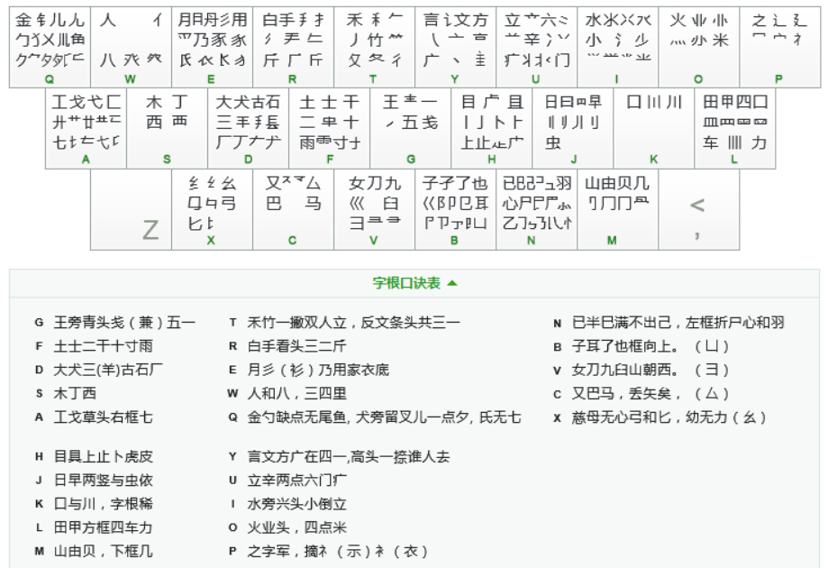

# <font color=#39c5bb> :sparkles: 跳转 </font>

> [rime码表](./DICT/rime)    
> [sougou自定义码表](./DICT/sougou)    

> [码表制作日志](./op-log.md)    

> [工具说明](./bin/readme.md)    

# <font color=#39c5bb> :sparkles: 目录结构 </font>

```shell
├── bin                          # 指令工具,部分需要编译src下的makefile生成
├── DICT                         # 码表目录
│   ├── breakups                 # 码表的拆分
│   ├── rime                     # rime用的码表
│   ├── rime-purelua(deprecated  # 纯lua给rime用的码表（弃用
│   └── sougou                   # sougou自定义码表
├── LICENSE
├── op-log.md
├── readme.md
├── share
│   ├── base                     # 基础词源:来自单词翻译
│   ├── dict-old(deprecated)     # 旧码表: 弃用
│   ├── encoder-data-single      # 86单字表: 8105规范字和大范围被编码的字
│   ├── freq                     # 450w频表
│   ├── looks-good               # 看起来还不错的成语
│   ├── pinyin                   # 90w拼音表
│   └── res-pictures
└── src
    ├── binsrc                   # bin工具的源码
    ├── c-core(deprecated)       # 旧的c解析码表用(弃用)
    ├── CMakeLists.txt           # makefile会调用这个Cmakelists.txt
    ├── cppcore                  # cpp写的表对象核心
    └── makefile                 # cd到目录下运行make以运行这个makefile
```

# <font color=#39c5bb> :sparkles: 输入法偏好配置 </font>

- [x] <font color=#ffa500>切换: alt + shift</font>
- [x] <font color=#ffa500>临时切换: shift</font>
- [x] <font color=#ffa500>反查: `` ` ``</font>
- [x] <font color=#ffa500>第四码不自动上屏，第五码顶上屏</font>
- [x] <font color=#ffa500>`空格` `;` `‘`代表1,2,3候选</font>
- [x] <font color=#ffa500>z键: 快捷语前缀 </font>
- [x] <font color=#ffa500>`[` `]`前后翻页</font>

# <font color=#39c5bb> :sparkles: 86五笔字根表(取自搜狗五笔) </font>


# <font color=#39c5bb> :sparkles: 86五笔编码规则(带扩展) </font>
> 注:带()的部分为合理扩展内容,意味着向下兼容原版

* <font color=#39c5bb>识别码</font><br>

> <font color=#ffa500>字结构可以分为`左右型` `上下型` `杂合型`</font>
> <font color=#ffa500>取最后一笔所在区的结构对应按键为识别码</font>

<font color=#ffa500>

||左右|上下|杂合|
|-|-|-|-|
|横|g|f|d|
|竖|h|j|k|
|撇|t|r|e|
|捺|y|u|i|
|折|n|b|v|

</font>

* <font color=#39c5bb>字</font><br>

<font color=#ffa500>

|一般字|成字字根|键名字|笔画字|
|-|-|-|-|
|每次取主观上<br>`最大的字根`<br>3码未取完<br>取末笔识别码|输入`所在位置`后,<br>加上`笔画`<br>3码未完<br>取末笔画|(`1简2号`)或<br>输入4次所在位置|ggll<br>hhll<br>ttll<br>yyll<br>nnll|

</font>

* <font color=#39c5bb>词</font>

<font color=#ffa500>

|二字|三字|多字|
|-|-|-|
|(每字的前1码)<br>或<br>每字的前2码|每字的前1码<br>或<br>每字的前1码最后一字取2码|每字的前1码最后一字取2码|

</font>


# <font color=#39c5bb>:sparkles: 词库</font>

## <font color=#39c5bb> :sparkles: 词库排序大体规则 </font>

> <font color=#ffa500>1号排字, 2号排`词/键名字`, 3号及以上排更多可能的选择</font><br>
> <font color=#ffa500>当1号实在没有字时, 1号排`词`, 2号及以上排更多可能的选择</font><br>

---
## <font color=#39c5bb> :sparkles: 测试性能记录 </font>

<font color=#ffa500>

| 词库行数 | 测试码长 |
|:-:|:-:|
| 108290 DICT/overview/fmt | unknown |

</font>

---
## <font color=#39c5bb> :sparkles: 1码 </font>
* <font color=#39c5bb> :rocket: 1简1号</font>

<font color=#ffa500>

|王|土|在|木|工|
|:-:|:-:|:-:|:-:|:-:|
|目|日|口|国|同|
|禾|的|有|人|我|
|主|着|水|火|之|
|民|了|发|又|经|

</font>

* <font color=#39c5bb> :rocket: 1简2号(键名字,个别与1简1号重复的带改动)</font>

<font color=#ffa500>

|一|都|在|要|藏|
|:-:|:-:|:-:|:-:|:-:|
|上|是|口|田|山|
|和|白|有|您|金|
|言|产|水|为|这|
|已|子|发|以|幺|

</font>

## <font color=#39c5bb> :sparkles: 2码 </font>
> <font color=#ffa500>2简1号,常为字,`直观2码单字`</font>
> <font color=#ffa500>2简2号,常为2字词,高频词和容易记住的叠叠字</font>

<font color=#ffa500>

|ag,1=七|af,1=或者|ad,1=苦|as,1=东西|aa,1=区区|
|:-|:-|:-|:-|:-|
|ag,2=基于|af,2=革|ad,2=基础|as,2=基本|aa,2=式|
||||||
|ah,1=项目|aj,1=或是|ak,1=区别|al,1=功|am,1=共同|
|ah,2=节目|aj,2=划|ak,2=其中|al,2=苗|am,2=贡|
||||||
|at,1=医生|ar,1=匠|ae,1=共用|aw,1=共|aq,1=著名|
|at,2=获得|ar,2=落后|ae,2=菜|aw,2=工作|aq,2=营销|
||||||
|ay,1=或许|au,1=期间|ai,1=荣耀|ao,1=基数|ap,1=警察|
|ay,2=英语|au,2=燕|ai,2=东|ao,2=蒌|ap,2=其实|
||||||
|an,1=恐惧|ab,1=医院|av,1=共建|ac,1=欺骗|ax,1=世纪|
|an,2=芯|ab,2=节|av,2=巧妙|ac,2=芭|ax,2=药|

</font>


---

<font color=#ffa500>

|bg,1=卫|bf,1=出去|bd,1=随|bs,1=耵|ba,1=阵营|
|:-|:-|:-|:-|:-|
|bg,2=出来|bf,2=陆|bd,2=也有|bs,2=也要|ba,2=隐藏|
||||||
|bh,1=阻止|bj,1=阳|bk,1=队员|bl,1=阵|bm,1=出|
|bh,2=防止|bj,2=联盟|bk,2=职|bl,2=承办|bm,2=耳朵|
||||||
|bt,1=取得|br,1=孤|be,1=阴|bw,1=阶段|bq,1=孤独|
|bt,2=联系|br,2=附近|be,2=聘用|bw,2=队|bq,2=了解|
||||||
|by,1=孓|bu,1=陪|bi,1=阳光|bo,1=耿|bp,1=阵容|
|by,2=也就|bu,2=随意|bi,2=孙|bo,2=职业|bp,2=辽|
||||||
|bn,1=出发|bb,1=孩子|bv,1=限|bc,1=取|bx,1=也比|
|bn,2=孔|bb,2=子|bv,2=子女|bc,2=也能|bx,2=陛|

</font>


---

<font color=#ffa500>

|cg,1=骊|cf,1=圣|cd,1=参|cs,1=骠|ca,1=预期|
|:-|:-|:-|:-|:-|
|cg,2=对于|cf,2=对|cd,2=对面|cs,2=又要|ca,2=戏|
||||||
|ch,1=马上|cj,1=骒|ck,1=驯|cl,1=驷|cm,1=观|
|ch,2=马马虎虎|cj,2=能量|ck,2=台|cl,2=能力|cm,2=参见|
||||||
|ct,1=通知|cr,1=牟|ce,1=能用|cw,1=观众|cq,1=欢迎|
|ct,2=预算|cr,2=矛盾|ce,2=能|cw,2=观念|cq,2=能够|
||||||
|cy,1=对方|cu,1=难道|ci,1=预测|co,1=熊熊燃烧|cp,1=观察|
|cy,2=对应|cu,2=骈|ci,2=通常|co,2=参数|cp,2=又被|
||||||
|cn,1=马|cb,1=预防|cv,1=劝退|cc,1=艰难|cx,1=柔弱|
|cn,2=巴|cb,2=骗子|cv,2=能忍|cc,2=双|cx,2=对比|

</font>


---

<font color=#ffa500>

|dg,1=三|df,1=破坏|dd,1=套|ds,1=成本|da,1=尤其|
|:-|:-|:-|:-|:-|
|dg,2=故事|df,2=夺|dd,2=厌|ds,2=大概|da,2=左|
||||||
|dh,1=有点|dj,1=大量|dk,1=夼|dl,1=历|dm,1=面|
|dh,2=有些|dj,2=百|dk,2=套路|dl,2=原因|dm,2=页|
||||||
|dt,1=帮|dr,1=原|de,1=胡|dw,1=有个|dq,1=大多|
|dt,2=故|dr,2=大的|de,2=而且|dw,2=有人|dq,2=克|
||||||
|dy,1=太|du,1=有关|di,1=大学|do,1=灰|dp,1=大家|
|dy,2=面试|du,2=有效|di,2=耗|do,2=垄断|dp,2=研究|
||||||
|dn,1=感情|db,1=顾|dv,1=肆|dc,1=雄|dx,1=在线|
|dn,2=而已|db,2=太阳|dv,2=百姓|dc,2=友|dx,2=大约|

</font>


---

<font color=#ffa500>

|eg,1=用于|ef,1=肝|ed,1=用在|es,1=脚本|ea,1=及其|
|:-|:-|:-|:-|:-|
|eg,2=且|ef,2=用过|ed,2=须|es,2=股票|ea,2=月薪|
||||||
|eh,1=鼐|ej,1=及时|ek,1=肿|el,1=助力|em,1=肌肉|
|eh,2=脸上|ej,2=胆|ek,2=用品|el,2=用力|em,2=肌|
||||||
|et,1=胜利|er,1=用的|ee,1=采用|ew,1=脸|eq,1=脸色|
|et,2=服务|er,2=采摘|ee,2=朋|ew,2=月份|eq,2=彩色|
||||||
|ey,1=采访|eu,1=服装|ei,1=尕|eo,1=用料|ep,1=爱|
|ey,2=用户|eu,2=膝盖|ei,2=逐渐|eo,2=肥料|ep,2=脑补|
||||||
|en,1=甩|eb,1=脑子|ev,1=舀|ec,1=脖颈|ex,1=脉络|
|en,2=爱情|eb,2=孕|ev,2=爱好|ec,2=肥|ex,2=脂|

</font>


---

<font color=#ffa500>

|fg,1=真正|ff,1=寺|fd,1=城|fs,1=老板|fa,1=规划|
|:-|:-|:-|:-|:-|
|fg,2=未来|ff,2=土|fd,2=志愿|fs,2=霜|fa,2=运营|
||||||
|fh,1=直|fj,1=井|fk,1=干嘛|fl,1=增加|fm,1=击|
|fh,2=考虑|fj,2=都是|fk,2=走路|fl,2=雷|fm,2=规则|
||||||
|ft,1=才|fr,1=真的|fe,1=运用|fw,1=都会|fq,1=无|
|ft,2=都|fr,2=圻|fe,2=圾|fw,2=夫|fq,2=元|
||||||
|fy,1=教育|fu,1=增|fi,1=示|fo,1=赤|fp,1=规定|
|fy,2=考试|fu,2=声音|fi,2=无法|fo,2=无数|fp,2=真实|
||||||
|fn,1=声|fb,1=无限|fv,1=雪|fc,1=支|fx,1=坳|
|fn,2=志|fb,2=邗|fv,2=夫妇|fc,2=云|fx,2=无比|

</font>


---

<font color=#ffa500>

|gg,1=五|gf,1=一直|gd,1=天|gs,1=不要|ga,1=形式|
|:-|:-|:-|:-|:-|
|gg,2=整整|gf,2=不过|gd,2=现在|gs,2=一样|ga,2=开|
||||||
|gh,1=下|gj,1=不是|gk,1=武器|gl,1=画|gm,1=不同|
|gh,2=正|gj,2=还是|gk,2=事|gl,2=更加|gm,2=再|
||||||
|gt,1=玫|gr,1=碧|ge,1=表|gw,1=不会|gq,1=更多|
|gt,2=一般|gr,2=来看|ge,2=不爱|gw,2=一个|gq,2=死|
||||||
|gy,1=玉|gu,1=平|gi,1=正常|go,1=事业|gp,1=玩家|
|gy,2=来说|gu,2=再次|gi,2=至少|go,2=来|gp,2=琛|
||||||
|gn,1=与|gb,1=顿|gv,1=妻|gc,1=不能|gx,1=一张|
|gn,2=事情|gb,2=到了|gv,2=更好|gc,2=到|gx,2=毒|

</font>


---

<font color=#ffa500>

|hg,1=上下|hf,1=上去|hd,1=上面|hs,1=上述|ha,1=虚|
|:-|:-|:-|:-|:-|
|hg,2=凸|hf,2=睹|hd,2=具有|hs,2=目标|ha,2=皮革|
||||||
|hh,1=瞧瞧|hj,1=此时|hk,1=眼中|hl,1=卤|hm,1=贞|
|hh,2=睡眠|hj,2=旧|hk,2=上路|hl,2=战略|hm,2=上网|
||||||
|ht,1=具备|hr,1=睥|he,1=战胜|hw,1=具体|hq,1=餐饮|
|ht,2=上午|hr,2=占据|he,2=肯|hw,2=具|hq,2=餐|
||||||
|hy,1=眩|hu,1=此次|hi,1=上学|ho,1=眯|hp,1=瞎|
|hy,2=上课|hu,2=瞳|hi,2=步|ho,2=点燃|hp,2=眼神|
||||||
|hn,1=卢|hb,1=眲|hv,1=目录|hc,1=卡通|hx,1=此|
|hn,2=点心|hb,2=上限|hv,2=眼|hc,2=皮|hx,2=上级|

</font>


---

<font color=#ffa500>

|ig,1=水平|if,1=兴趣|id,1=消耗|is,1=洒|ia,1=江|
|:-|:-|:-|:-|:-|
|ig,2=汪|if,2=汗|id,2=尖|is,2=清楚|ia,2=小区|
||||||
|ih,1=水上|ij,1=当时|ik,1=满足|il,1=渐|im,1=油|
|ih,2=小|ij,2=流量|ik,2=澡|il,2=添加|im,2=常见|
||||||
|it,1=少|ir,1=泊|ie,1=常用|iw,1=兴|iq,1=光|
|it,2=学生|ir,2=掌握|ie,2=肖|iw,2=学会|iq,2=当然|
||||||
|iy,1=酒店|iu,1=滚|ii,1=渐渐|io,1=酒精|ip,1=当初|
|iy,2=测试|iu,2=注意|ii,2=水|io,2=淡|ip,2=常|
||||||
|in,1=激情|ib,1=小孩|iv,1=少女|ic,1=汉|ix,1=消费|
|in,2=沁|ib,2=演出|iv,2=当|ic,2=沟通|ix,2=浪费|

</font>


---

<font color=#ffa500>

|jg,1=量|jf,1=里|jd,1=最大|js,1=果|ja,1=虹|
|:-|:-|:-|:-|:-|
|jg,2=是否|jf,2=时|jd,2=晨|js,2=题材|ja,2=日期|
||||||
|jh,1=题目|jj,1=昌|jk,1=是吧|jl,1=暴力|jm,1=电网|
|jh,2=早餐|jj,2=明明|jk,2=蝇|jl,2=曼|jm,2=遇|
||||||
|jt,1=照片|jr,1=明白|je,1=明月|jw,1=时候|jq,1=晚|
|jt,2=昨|jr,2=最后|je,2=电脑|jw,2=时代|jq,2=最多|
||||||
|jy,1=申请|ju,1=时间|ji,1=日常|jo,1=显|jp,1=电视|
|jy,2=电话|ju,2=暗|ji,2=电池|jo,2=炅|jp,2=最初|
||||||
|jn,1=虬|jb,1=日子|jv,1=最好|jc,1=最难|jx,1=最终|
|jn,2=电|jb,2=电子|jv,2=明媚|jc,2=畅通|jx,2=紧张|

</font>


---

<font color=#ffa500>

|kg,1=呈|kf,1=患者|kd,1=号码|ks,1=呆|ka,1=中期|
|:-|:-|:-|:-|:-|
|kg,2=听到|kf,2=叶|kd,2=只有|ks,2=吐槽|ka,2=呀|
||||||
|kh,1=中|kj,1=虽|kk,1=哈哈|kl,1=听力|km,1=呗|
|kh,2=哪些|kj,2=哪里|kk,2=吕|kl,2=吵架|km,2=员|
||||||
|kt,1=品牌|kr,1=品质|ke,1=只用|kw,1=中华|kq,1=兄|
|kt,2=顺利|kr,2=别的|ke,2=吸|kw,2=别人|kq,2=史|
||||||
|ky,1=距离|ku,1=中间|ki,1=嗨|ko,1=喽|kp,1=踏实|
|ky,2=听说|ku,2=味道|ki,2=啤酒|ko,2=中断|kp,2=鄙视|
||||||
|kn,1=哪怕|kb,1=啊|kv,1=号召|kc,1=吧|kx,1=哟|
|kn,2=叫|kb,2=跟随|kv,2=哪|kc,2=嘴巴|kx,2=吸引|

</font>


---

<font color=#ffa500>

|lg,1=车|lf,1=轩|ld,1=因|ls,1=轻松|la,1=轼|
|:-|:-|:-|:-|:-|
|lg,2=回到|lf,2=回去|ld,2=界面|ls,2=思想|la,2=困惑|
||||||
|lh,1=因此|lj,1=辊|lk,1=图中|ll,1=默默|lm,1=团购|
|lh,2=四|lj,2=力量|lk,2=思路|ll,2=男|lm,2=国内|
||||||
|lt,1=图片|lr,1=斩|le,1=轮胎|lw,1=办|lq,1=国外|
|lt,2=回答|lr,2=回报|le,2=胃|lw,2=男人|lq,2=连锁|
||||||
|ly,1=因为|lu,1=回头|li,1=办法|lo,1=轰炸|lp,1=国家|
|ly,2=力度|lu,2=圈|li,2=罪孽深重|lo,2=辚|lp,2=回家|
||||||
|ln,1=思|lb,1=输出|lv,1=男女|lc,1=轻|lx,1=思维|
|ln,2=回收|lb,2=囝|lv,2=轨|lc,2=驾驶|lx,2=连续|

</font>


---

<font color=#ffa500>

|mg,1=周末|mf,1=刚才|md,1=央|ms,1=同样|ma,1=曲|
|:-|:-|:-|:-|:-|
|mg,2=贱|mf,2=见过|md,2=网友|ms,2=风格|ma,2=周期|
||||||
|mh,1=由|mj,1=风景|mk,1=账号|ml,1=崽|mm,1=巅峰|
|mh,2=网上|mj,2=同时|mk,2=迥|ml,2=周围|mm,2=刚刚|
||||||
|mt,1=购物|mr,1=贩|me,1=风采|mw,1=邮件|mq,1=见|
|mt,2=败|mr,2=崇拜|me,2=骨|mw,2=岗位|mq,2=风|
||||||
|my,1=账户|mu,1=赠送|mi,1=同学|mo,1=嶙|mp,1=迪|
|my,2=几率|mu,2=赚|mi,2=嵴|mo,2=同类|mp,2=财富|
||||||
|mn,1=岂|mb,1=邮|mv,1=屶|mc,1=殳|mx,1=曲线|
|mn,2=购买|mb,2=风险|mv,2=刚好|mc,2=凤|mx,2=网络|

</font>


---

<font color=#ffa500>

|ng,1=以下|nf,1=展示|nd,1=发布|ns,1=怵|na,1=懂|
|:-|:-|:-|:-|:-|
|ng,2=发现|nf,2=导|nd,2=情感|ns,2=司机|na,2=民|
||||||
|nh,1=以上|nj,1=心里|nk,1=性别|nl,1=心思|nm,1=以内|
|nh,2=以此|nj,2=慢|nk,2=避|nl,2=惭|nm,2=届|
||||||
|nt,1=必|nr,1=以后|ne,1=必须|nw,1=尸体|nq,1=避免|
|nt,2=发生|nr,2=怕|ne,2=避孕|nw,2=收集|nq,2=快乐|
||||||
|ny,1=改变|nu,1=飞|ni,1=悄|no,1=屎|np,1=买家|
|ny,2=心|nu,2=情况|ni,2=异常|no,2=蛋糕|np,2=书写|
||||||
|nn,1=习惯|nb,1=展出|nv,1=恨|nc,1=惨|nx,1=惯|
|nn,2=慢慢|nb,2=敢|nv,2=愤怒|nc,2=尾巴|nx,2=已经|

</font>


---

<font color=#ffa500>

|og,1=业|of,1=灶|od,1=精确|os,1=灯|oa,1=烧|
|:-|:-|:-|:-|:-|
|og,2=精致|of,2=灯塔|od,2=类|os,2=爆棚|oa,2=迷茫|
||||||
|oh,1=粘|oj,1=烛|ok,1=类别|ol,1=烟|om,1=业内|
|oh,2=数目|oj,2=爆|ok,2=精品|ol,2=精力|om,2=精髓|
||||||
|ot,1=精选|or,1=数据|oe,1=火腿|ow,1=粉|oq,1=米饭|
|ot,2=业务|or,2=粕|oe,2=粗|ow,2=类似|oq,2=火锅|
||||||
|oy,1=业主|ou,1=烂|oi,1=炒|oo,1=炎|op,1=迷|
|oy,2=迷恋|ou,2=精美|oi,2=数学|oo,2=燃烧|op,2=精神|
||||||
|on,1=烦恼|ob,1=籽|ov,1=精灵|oc,1=精通|ox,1=粉丝|
|on,2=爆发|ob,2=粒子|ov,2=娄|oc,2=粑|ox,2=业绩|

</font>


---

<font color=#ffa500>

|pg,1=写|pf,1=宗教|pd,1=完成|ps,1=农村|pa,1=宽|
|:-|:-|:-|:-|:-|
|pg,2=实现|pf,2=守|pd,2=突破|ps,2=宁|pa,2=社区|
||||||
|ph,1=视频|pj,1=容易|pk,1=初中|pl,1=实力|pm,1=宝贝|
|ph,2=寂|pj,2=家里|pk,2=实践|pl,2=家园|pm,2=宙|
||||||
|pt,1=实行|pr,1=安排|pe,1=家|pw,1=安全|pq,1=冤|
|pt,2=家长|pr,2=牢|pe,2=客服|pw,2=完全|pq,2=之外|
||||||
|py,1=客户|pu,1=之间|pi,1=视觉|po,1=农业|pp,1=之|
|py,2=补充|pu,2=被|pi,2=宵|po,2=之类|pp,2=冠军|
||||||
|pn,1=农民|pb,1=字|pv,1=安|pc,1=客观|px,1=字母|
|pn,2=实习|pb,2=实际|pv,2=初始|pc,2=实验|px,2=神经|

</font>


---

<font color=#ffa500>

|qg,1=留下|qf,1=针|qd,1=然|qs,1=解析|qa,1=氏|
|:-|:-|:-|:-|:-|
|qg,2=钱|qf,2=外卖|qd,2=然而|qs,2=杀|qa,2=解散|
||||||
|qh,1=钋|qj,1=旬|qk,1=句|ql,1=忽略|qm,1=乐曲|
|qh,2=外|qj,2=象|qk,2=名|ql,2=甸|qm,2=负|
||||||
|qt,1=解释|qr,1=勿|qe,1=色彩|qw,1=销售|qq,1=多|
|qt,2=狗|qr,2=然后|qe,2=角|qw,2=包含|qq,2=角色|
||||||
|qy,1=希望|qu,1=解决|qi,1=乐|qo,1=炙|qp,1=锭|
|qy,2=角度|qu,2=匀|qi,2=多少|qo,2=锻炼|qp,2=名字|
||||||
|qn,1=触发|qb,1=儿子|qv,1=儿女|qc,1=针对|qx,1=镪|
|qn,2=包|qb,2=凶|qv,2=犹如|qc,2=勾|qx,2=勉强|

</font>


---

<font color=#ffa500>

|rg,1=找到|rf,1=持|rd,1=所有|rs,1=手机|ra,1=找|
|:-|:-|:-|:-|:-|
|rg,2=后|rf,2=失去|rd,2=拓|rs,2=打|ra,2=技巧|
||||||
|rh,1=看|rj,1=按照|rk,1=扣|rl,1=舞|rm,1=抽|
|rh,2=年|rj,2=摄影|rk,2=舞蹈|rl,2=押|rm,2=看见|
||||||
|rt,1=手|rr,1=看看|re,1=扔|rw,1=提供|rq,1=接触|
|rt,2=提升|rr,2=折|re,2=接受|rw,2=操作|rq,2=报名|
||||||
|ry,1=提高|ru,1=拉|ri,1=欣赏|ro,1=指数|rp,1=近|
|ry,2=的话|ru,2=看着|ri,2=朱|ro,2=搂|rp,2=指定|
||||||
|rn,1=所|rb,1=招聘|rv,1=看好|rc,1=把|rx,1=拒绝|
|rn,2=所以|rb,2=报|rv,2=扫|rc,2=技能|rx,2=持续|

</font>


---

<font color=#ffa500>

|sg,1=模型|sf,1=模块|sd,1=配套|ss,1=梦想|sa,1=杠|
|:-|:-|:-|:-|:-|
|sg,2=本|sf,2=要求|sd,2=构成|ss,2=想想|sa,2=模式|
||||||
|sh,1=禁止|sj,1=标题|sk,1=可|sl,1=权力|sm,1=机|
|sh,2=相|sj,2=查|sk,2=机器|sl,2=楞|sm,2=歌曲|
||||||
|st,1=覆|sr,1=析|se,1=杉|sw,1=相信|sq,1=攀|
|st,2=本科|sr,2=根据|se,2=可爱|sw,2=机会|sq,2=格外|
||||||
|sy,1=概率|su,1=样|si,1=档|so,1=模糊|sp,1=档案|
|sy,2=术|su,2=相关|si,2=想法|so,2=杰|sp,2=要害|
||||||
|sn,1=杨|sb,1=权限|sv,1=要好|sc,1=相对|sx,1=顶级|
|sn,2=核心|sb,2=李|sv,2=要|sc,2=可能|sx,2=相比|

</font>


---

<font color=#ffa500>

|tg,1=生|tf,1=行动|td,1=造成|ts,1=重要|ta,1=长|
|:-|:-|:-|:-|:-|
|tg,2=每天|tf,2=行|td,2=短|ts,2=怎样|ta,2=选项|
||||||
|th,1=特点|tj,1=待遇|tk,1=各|tl,1=累积|tm,1=选购|
|th,2=重点|tj,2=得|tk,2=特别|tl,2=务|tm,2=自由|
||||||
|tt,1=等等|tr,1=选择|te,1=秀|tw,1=我们|tq,1=特色|
|tt,2=怎么|tr,2=物|te,2=利用|tw,2=答|tq,2=很多|
||||||
|ty,1=程度|tu,1=知道|ti,1=秒|to,1=行业|tp,1=管|
|ty,2=告诉|tu,2=剩|ti,2=生活|to,2=各类|tp,2=答案|
||||||
|tn,1=乞|tb,1=得出|tv,1=复杂|tc,1=智能|tx,1=升级|
|tn,2=很快|tb,2=季|tv,2=委|tc,2=么|tx,2=第|

</font>


---

<font color=#ffa500>

|ug,1=关于|uf,1=斗|ud,1=头|us,1=闲|ua,1=并|
|:-|:-|:-|:-|:-|
|ug,2=病毒|uf,2=冲击|ud,2=状态|us,2=美术|ua,2=痛苦|
||||||
|uh,1=站点|uj,1=效果|uk,1=道路|ul,1=旁边|um,1=意见|
|uh,2=道具|uj,2=问题|uk,2=产品|ul,2=曾|um,2=单曲|
||||||
|ut,1=首先|ur,1=新手|ue,1=普及|uw,1=闪|uq,1=资金|
|ut,2=准备|ur,2=瓣|ue,2=前|uw,2=部分|uq,2=音乐|
||||||
|uy,1=六|uu,1=立|ui,1=交流|uo,1=资料|up,1=决定|
|uy,2=阅读|uu,2=问问|ui,2=冰|uo,2=判断|up,2=商家|
||||||
|un,1=头发|ub,1=部队|uv,1=美好|uc,1=普通|ux,1=曾经|
|un,2=闷|ub,2=兼职|uv,2=立即|uc,2=冯|ux,2=总结|

</font>


---

<font color=#ffa500>

|vg,1=嫩|vf,1=寻求|vd,1=建成|vs,1=杂|va,1=如期|
|:-|:-|:-|:-|:-|
|vg,2=召开|vf,2=灵魂|vd,2=姑|vs,2=那样|va,2=奶茶|
||||||
|vh,1=肀|vj,1=如果|vk,1=召|vl,1=甾|vm,1=群内|
|vh,2=那些|vj,2=旭|vk,2=如|vl,2=舅|vm,2=妯|
||||||
|vt,1=那种|vr,1=婢|ve,1=录用|vw,1=如何|vq,1=姓名|
|vt,2=那么|vr,2=寻找|ve,2=忍受|vw,2=好像|vq,2=女儿|
||||||
|vy,1=建议|vu,1=嫌|vi,1=录|vo,1=妖精|vp,1=巡|
|vy,2=建设|vu,2=建立|vi,2=即兴|vo,2=灵|vp,2=婚礼|
||||||
|vn,1=妖怪|vb,1=她|vv,1=妇|vc,1=妈|vx,1=婚纱|
|vn,2=刀|vb,2=女孩|vv,2=姐姐|vc,2=毁于|vx,2=始终|

</font>


---

<font color=#ffa500>

|wg,1=今天|wf,1=领域|wd,1=估|ws,1=价格|wa,1=公式|
|:-|:-|:-|:-|:-|
|wg,2=全|wf,2=仁|wd,2=代码|ws,2=休|wa,2=代|
||||||
|wh,1=依旧|wj,1=但是|wk,1=作品|wl,1=集团|wm,1=体内|
|wh,2=个|wj,2=介|wk,2=保|wl,2=佃|wm,2=仙|
||||||
|wt,1=信息|wr,1=伯|we,1=佣|ww,1=从|wq,1=依然|
|wt,2=作|wr,2=保护|we,2=仍|ww,2=你们|wq,2=分钟|
||||||
|wy,1=信|wu,1=们|wi,1=化学|wo,1=企业|wp,1=人家|
|wy,2=分享|wu,2=创意|wi,2=偿|wo,2=伙|wp,2=侬|
||||||
|wn,1=领导|wb,1=仓|wv,1=分|wc,1=公|wx,1=化|
|wn,2=亿|wb,2=他|wv,2=你好|wc,2=体验|wx,2=父母|

</font>


---

<font color=#ffa500>

|xg,1=结束|xf,1=引起|xd,1=组成|xs,1=幻想|xa,1=经营|
|:-|:-|:-|:-|:-|
|xg,2=终于|xf,2=续|xd,2=绑|xs,2=缥|xa,2=红|
||||||
|xh,1=终点|xj,1=弗|xk,1=级别|xl,1=细|xm,1=纳|
|xh,2=弱点|xj,2=旨|xk,2=强|xl,2=比较|xm,2=经典|
||||||
|xt,1=给我|xr,1=维护|xe,1=细胞|xw,1=比例|xq,1=绿色|
|xt,2=编程|xr,2=维持|xe,2=费用|xw,2=给|xq,2=约|
||||||
|xy,1=强调|xu,1=毕竟|xi,1=纱|xo,1=毕业|xp,1=约定|
|xy,2=统计|xu,2=弱|xi,2=经常|xo,2=继|xp,2=比赛|
||||||
|xn,1=幻|xb,1=弛|xv,1=比如|xc,1=绝对|xx,1=继续|
|xn,2=练习|xb,2=继承|xv,2=绿|xc,2=经验|xx,2=组织|

</font>


---

<font color=#ffa500>

|yg,1=调整|yf,1=永远|yd,1=放在|ys,1=订|ya,1=计划|
|:-|:-|:-|:-|:-|
|yg,2=请|yf,2=计|yd,2=方面|ys,2=床|ya,2=方式|
||||||
|yh,1=为此|yj,1=这里|yk,1=识别|yl,1=设置|ym,1=认同|
|yh,2=这些|yj,2=齐|yk,2=诶嘿|yl,2=主办|ym,2=高峰|
||||||
|yt,1=熟悉|yr,1=广播|ye,1=衣|yw,1=文化|yq,1=底|
|yt,2=记得|yr,2=亵|ye,2=衣服|yw,2=就会|yq,2=义|
||||||
|yy,1=文|yu,1=说|yi,1=说法|yo,1=变|yp,1=文字|
|yy,2=方|yu,2=这次|yi,2=方法|yo,2=麻烦|yp,2=方案|
||||||
|yn,1=记忆|yb,1=房子|yv,1=良好|yc,1=应对|yx,1=玄|
|yn,2=读书|yb,2=为了|yv,2=庸|yc,2=就能|yx,2=率|

</font>


---

## <font color=#39c5bb> :sparkles: 3码 </font>
> <font color=#ffa500>3码内容过多不宜展示。</font>

<font color=#ffa500>

| 3码1号位为3字词总数 |与理论最高值比(8369/15625)|
|:-:|:-:|
|8369|53.56 %|

</font>

<font color=#ffa500>

| 3码2号位为3字词总数 |与理论最高值比(5444/15625)|
|:-:|:-:|
|5444|34.84 %|

</font>

## <font color=#39c5bb> :sparkles: 4码 </font>
> <font color=#ffa500>4码为全码，内容过多不宜展示。</font>

<font color=#ffa500>

| 4码1号位为4字词总数 |与理论最高值比(3410/390625)|
|:-:|:-:|
|3410|0.87 %|

</font>

<font color=#ffa500>

| 4码2号位为4字词总数 |与理论最高值比(471/390625)|
|:-:|:-:|
|471|0.12 %|

</font>
<font color=#ff0044>

<center>Wed Mar 11 02:33:41 AM CST 2026</center><br>
<center>Written by Vito Devlin(condexpr01@outlook.com) :tada: </center><br>

<center>Auto generated by running: `./bin/gen-readme DICT/overview/fmt ` </center><br>

</font>
